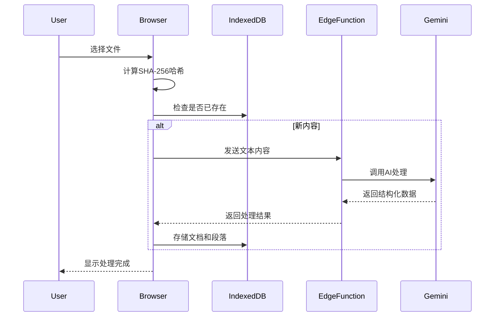
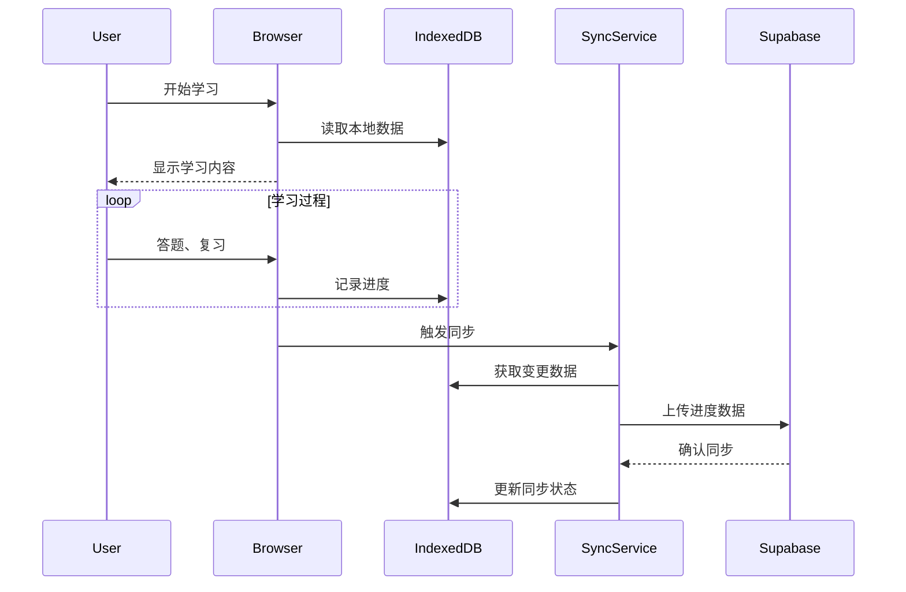
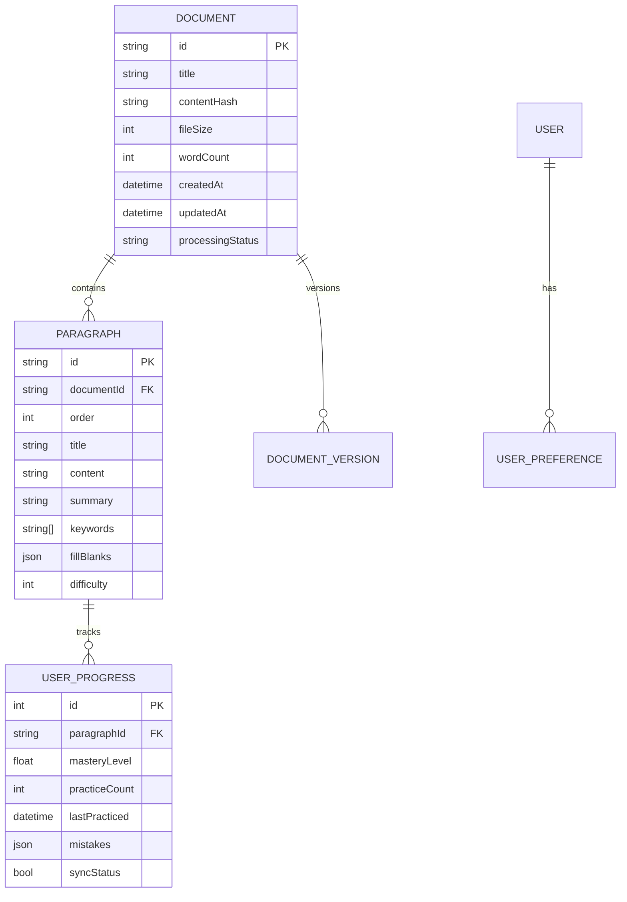
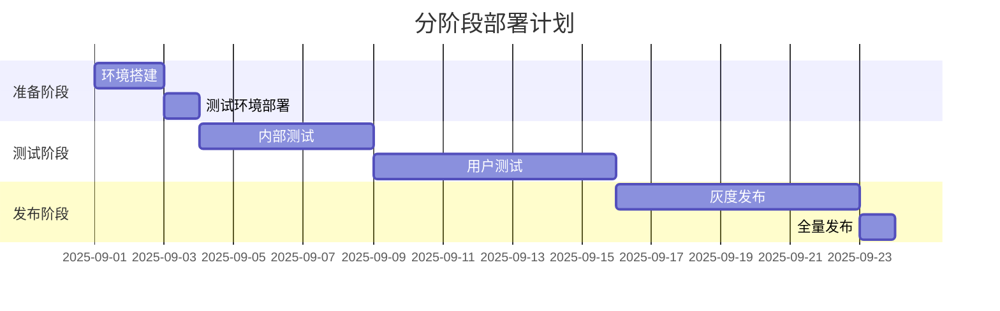

# 记忆回响v3.0升级开发需求文档

**项目代号**：记忆回响 v3.0  
**版本号**：3.0.0  
**文档版本**：1.0  
**创建日期**：2025年8月31日  
**文档状态**：正式发布  

---

## 📋 目录

1. [项目概述](#项目概述)
2. [升级目标与战略](#升级目标与战略)
3. [架构升级详述](#架构升级详述)
4. [功能需求规格](#功能需求规格)
5. [技术实现方案](#技术实现方案)
6. [数据模型设计](#数据模型设计)
7. [接口规范](#接口规范)
8. [用户界面重构](#用户界面重构)
9. [测试策略](#测试策略)
10. [部署与迁移](#部署与迁移)
11. [风险评估](#风险评估)
12. [开发计划](#开发计划)

---

## 1. 项目概述

### 1.1 项目背景

记忆回响项目从v2.0的专用型天文馆讲解员培训工具，升级为v3.0通用型AI赋能个性化学习平台。本次升级将实现从"云为中心"到"本地优先"的根本性架构转变。

### 1.2 核心转变

| 维度 | v2.0 (当前) | v3.0 (目标) |
|------|-------------|-------------|
| **产品定位** | 天文馆专用工具 | 通用学习平台 |
| **内容来源** | 预设固定内容 | 用户上传任意材料 |
| **数据存储** | 云端为主 | 本地优先，云端同步 |
| **AI角色** | 天文内容专家 | 通用学习助手 |
| **用户群体** | 博物馆讲解员 | 任何学习者 |

---

## 2. 升级目标与战略

### 2.1 战略目标

#### 2.1.1 技术目标
- ✅ 实现100%离线可用性
- ✅ 将响应时间从500ms降至50ms以下
- ✅ 支持任意格式文本材料处理
- ✅ 实现跨设备无缝同步

#### 2.1.2 产品目标
- ✅ 降低用户使用门槛至"零配置"
- ✅ 增强数据隐私保护
- ✅ 扩大目标用户群体10倍以上
- ✅ 提升学习体验个性化程度

### 2.2 核心原则

1. **本地优先 (Local-First)**
   - 所有核心数据存储在用户设备
   - 完全离线功能支持
   - 用户拥有完整数据控制权

2. **AI赋能 (AI-Powered)**
   - 智能内容分析与结构化
   - 个性化学习路径生成
   - 自适应难度调整

3. **隐私保护 (Privacy-First)**
   - 原文内容默认不上传云端
   - 端到端加密同步
   - 透明的数据使用政策

4. **无缝体验 (Seamless)**
   - 一键上传，自动处理
   - 即时响应，无感知同步
   - 跨设备状态恢复

---

## 3. 架构升级详述

### 3.1 架构对比

#### 3.1.1 v2.0架构
```
┌─────────────────┐    ┌─────────────────┐    ┌─────────────────┐
│   前端 (Vue)    │───▶│  Supabase后端   │───▶│   SiliconFlow   │
│                 │    │   PostgreSQL    │    │     AI API      │
└─────────────────┘    └─────────────────┘    └─────────────────┘
```

#### 3.1.2 v3.0架构
```
┌─────────────────────────────────────────────────────────────┐
│                    用户浏览器                                │
│  ┌─────────────────┐    ┌─────────────────┐                 │
│  │   前端 (Vue3)   │    │   IndexedDB     │                 │
│  │                 │◄───┤   (Dexie.js)    │                 │
│  └────────┬────────┘    └────────┬────────┘                 │
│           │                    │                             │
│  ┌────────┴────────┐    ┌──────┴──────┐                      │
│  │  本地处理引擎   │    │  同步服务   │                      │
│  │  (Web Workers)  │    │  (Background)│                      │
│  └─────────────────┘    └──────┬──────┘                      │
└────────────────────────────────┼─────────────────────────────┘
                                 │ HTTPS
                    ┌────────────┴────────────┐
                    │   Supabase Edge         │
                    │   Functions +           │
                    │   Gemini API            │
                    └─────────────────────────┘
```

### 3.2 数据流转设计

#### 3.2.1 内容上传与处理流程


#### 3.2.2 学习与同步流程


---

## 4. 功能需求规格

### 4.1 核心功能模块

#### 4.1.1 文档管理
- **文档上传**
  - 支持格式：TXT, PDF, DOC, DOCX, MD
  - 最大文件大小：10MB
  - 批量上传支持
  - 拖拽上传界面

- **文档处理**
  - 自动内容提取
  - 智能分段算法
  - 关键词自动提取
  - 难度等级评估

- **文档列表**
  - 本地文档管理
  - 搜索与筛选
  - 分类标签系统
  - 学习进度可视化

#### 4.1.2 学习模式
- **填空训练**
  - 智能空白生成
  - 实时答案验证
  - 错题收集功能
  - 自适应难度调整

- **复述训练**
  - 语音转文字
  - AI内容评估
  - 改进建议生成
  - 语音回放对比

- **自由复习**
  - 间隔重复算法
  - 个性化复习计划
  - 学习效果统计
  - 知识点图谱

#### 4.1.3 同步与备份
- **自动同步**
  - 实时进度同步
  - 增量数据更新
  - 冲突解决机制
  - 同步状态指示

- **手动备份**
  - 一键导出数据
  - 跨设备二维码分享
  - 数据恢复功能
  - 版本历史管理

### 4.2 用户界面需求

#### 4.2.1 响应式设计
- **桌面端** (1440px+)
- **平板端** (768px-1439px)
- **手机端** (320px-767px)

#### 4.2.2 主题系统
- **浅色主题** (默认)
- **深色主题** (可选)
- **高对比度** (无障碍支持)

---

## 5. 技术实现方案

### 5.1 核心技术栈

#### 5.1.1 前端技术
```typescript
// 主要依赖
{
  "vue": "^3.4.0",
  "typescript": "^5.3.0",
  "vite": "^5.0.0",
  "dexie": "^3.2.4",
  "crypto-js": "^4.2.0",
  "@google/generative-ai": "^0.2.0",
  "lucide-vue-next": "^0.300.0",
  "vue-router": "^4.2.0",
  "pinia": "^2.1.0"
}
```

#### 5.1.2 后端技术
```typescript
// Supabase Edge Functions
{
  "runtime": "deno",
  "dependencies": [
    "@google/generative-ai",
    "std/http",
    "std/crypto"
  ]
}
```

### 5.2 关键实现细节

#### 5.2.1 内容哈希算法
```typescript
async function calculateContentHash(content: string): Promise<string> {
  const encoder = new TextEncoder();
  const data = encoder.encode(content);
  const hashBuffer = await crypto.subtle.digest('SHA-256', data);
  const hashArray = Array.from(new Uint8Array(hashBuffer));
  return hashArray.map(b => b.toString(16).padStart(2, '0')).join('');
}
```

#### 5.2.2 本地数据库设计
```typescript
// Dexie.js 数据库定义
class LearningDatabase extends Dexie {
  documents!: Table<Document, string>;
  paragraphs!: Table<Paragraph, string>;
  userProgress!: Table<UserProgress, number>;
  syncStatus!: Table<SyncStatus, string>;

  constructor() {
    super('LearningDB');
    
    this.version(4).stores({
      documents: '&id, title, createdAt, updatedAt, fileSize, processingStatus',
      paragraphs: '&id, documentId, order, difficulty, keywords',
      userProgress: '++id, paragraphId, masteryLevel, lastPracticed, syncStatus',
      syncStatus: '&tableName, lastSyncTime, pendingChanges'
    });
  }
}
```

---

## 6. 数据模型设计

### 6.1 核心实体关系



### 6.2 详细数据结构

#### 6.2.1 Document 文档表
```typescript
interface Document {
  id: string; // SHA-256 内容哈希
  title: string;
  originalFileName: string;
  fileType: 'txt' | 'pdf' | 'doc' | 'docx' | 'md';
  fileSize: number; // 字节
  wordCount: number;
  
  content: string; // 原始文本内容
  contentHash: string; // 内容哈希
  
  processingStatus: 'pending' | 'processing' | 'completed' | 'error';
  processingError?: string;
  
  aiModel: string; // 处理时使用的模型
  aiVersion: string; // 模型版本
  
  createdAt: Date;
  updatedAt: Date;
  lastAccessedAt: Date;
  
  tags: string[];
  category?: string;
  difficulty: 1 | 2 | 3 | 4 | 5; // 整体难度
  estimatedStudyTime: number; // 分钟
}
```

#### 6.2.2 Paragraph 段落表
```typescript
interface Paragraph {
  id: string; // UUID v4
  documentId: string; // 关联文档ID
  order: number; // 段落顺序
  
  title: string; // 段落标题 (10-20字)
  content: string; // 原始内容 (50-150字)
  summary: string; // 核心摘要 (30-50字)
  
  keywords: string[]; // 关键词数组 (3-5个)
  keyConcepts: { // 关键概念详细定义
    term: string;
    definition: string;
    importance: 1-5;
  }[];
  
  fillBlanks: {
    textWithPlaceholders: string; // 带空白的文本
    answers: string[]; // 正确答案数组
    hints: string[]; // 提示信息
    difficulty: 1-5; // 填空难度
  };
  
  difficulty: 1-5; // 段落整体难度
  learningTips: string; // 学习建议
  estimatedTime: number; // 预计学习时间(分钟)
  
  metadata: {
    sentenceCount: number;
    avgWordLength: number;
    readingLevel: string; // 阅读难度等级
  };
}
```

#### 6.2.3 UserProgress 用户进度表
```typescript
interface UserProgress {
  id?: number; // 自增主键
  paragraphId: string;
  
  masteryLevel: number; // 掌握程度 0-100
  practiceCount: number; // 练习次数
  correctCount: number; // 正确次数
  
  lastPracticed: Date;
  nextReview: Date; // 下次复习时间 (间隔重复)
  
  mistakes: { // 错误记录
    type: 'blank' | 'recitation';
    content: string;
    userAnswer: string;
    correctAnswer: string;
    timestamp: Date;
  }[];
  
  streak: number; // 连续正确天数
  totalTimeSpent: number; // 总学习时间(秒)
  
  syncStatus: 'local' | 'synced' | 'pending' | 'error';
  lastSync: Date;
}
```

---

## 7. 接口规范

### 7.1 Edge Functions API

#### 7.1.1 内容处理接口
```typescript
POST /api/process-content
{
  "textContent": string,
  "options": {
    "targetDifficulty": 1-5,
    "generateBlanks": boolean,
    "generateSummary": boolean,
    "customPrompts": string[]
  }
}

Response:
{
  "success": boolean,
  "data": {
    "metadata": {
      "totalParagraphs": number,
      "estimatedStudyTime": number,
      "difficultyDistribution": object
    },
    "paragraphs": Paragraph[]
  },
  "error?: string
}
```

#### 7.1.2 进度同步接口
```typescript
POST /api/sync-progress
{
  "userId": string,
  "deviceId": string,
  "progress": UserProgress[],
  "lastSync": Date
}

Response:
{
  "success": boolean,
  "data": {
    "synced": number,
    "conflicts": object[],
    "serverTimestamp": Date
  }
}
```

### 7.2 本地存储API

#### 7.2.1 文档操作
```typescript
// 文档管理
class DocumentService {
  async createDocument(file: File): Promise<Document>
  async getDocument(id: string): Promise<Document | undefined>
  async updateDocument(id: string, updates: Partial<Document>): Promise<void>
  async deleteDocument(id: string): Promise<void>
  async listDocuments(options: ListOptions): Promise<Document[]>
}

// 学习进度
class ProgressService {
  async updateProgress(paragraphId: string, progress: Partial<UserProgress>): Promise<void>
  async getProgress(paragraphId: string): Promise<UserProgress | undefined>
  async getStudyStats(): Promise<StudyStats>
}
```

---

## 8. 用户界面重构

### 8.1 页面结构重设计

#### 8.1.1 新页面架构
```
src/pages/
├── WelcomePage.vue          # 欢迎与介绍
├── DocumentUploadPage.vue   # 文档上传
├── DocumentListPage.vue     # 文档管理
├── StudyPage.vue           # 学习主页面
├── TrainingPage.vue        # 训练模式
├── ReviewPage.vue          # 复习模式
├── SettingsPage.vue        # 设置页面
├── SyncStatusPage.vue      # 同步状态
└── HelpPage.vue           # 帮助文档
```

#### 8.1.2 核心组件更新
```
src/components/
├── upload/
│   ├── FileDropZone.vue
│   ├── UploadProgress.vue
│   └── DocumentPreview.vue
├── study/
│   ├── ParagraphCard.vue
│   ├── FillBlankExercise.vue
│   ├── RecitationRecorder.vue
│   └── ProgressTracker.vue
├── common/
│   ├── OfflineIndicator.vue
│   ├── SyncStatus.vue
│   └── ThemeToggle.vue
```

### 8.2 响应式设计系统

#### 8.2.1 断点系统
```css
/* Tailwind 配置扩展 */
screens: {
  'xs': '475px',
  'sm': '640px',
  'md': '768px',
  'lg': '1024px',
  'xl': '1280px',
  '2xl': '1536px',
}
```

#### 8.2.2 无障碍设计
- **键盘导航**：所有功能支持Tab键导航
- **屏幕阅读器**：完整ARIA标签支持
- **高对比度**：WCAG 2.1 AA标准
- **字体缩放**：支持200%缩放不失真

---

## 9. 测试策略

### 9.1 测试金字塔

```
            端到端测试 (10%)
                  │
            集成测试 (30%)
                  │
            单元测试 (60%)
```

### 9.2 测试覆盖要求

#### 9.2.1 单元测试
- **业务逻辑**：90%+ 覆盖率
- **数据操作**：95%+ 覆盖率
- **工具函数**：100% 覆盖率

#### 9.2.2 集成测试
- **IndexedDB操作**：所有CRUD操作
- **API调用**：成功/失败场景
- **同步机制**：冲突解决

#### 9.2.3 端到端测试
- **用户流程**：上传→学习→同步完整流程
- **离线场景**：断网/弱网环境测试
- **跨设备**：数据一致性验证

### 9.3 测试工具
```json
{
  "unit": "vitest",
  "component": "@vue/test-utils",
  "e2e": "playwright",
  "mock": "msw",
  "coverage": "c8"
}
```

---

## 10. 部署与迁移

### 10.1 部署策略

#### 10.1.1 分阶段部署


#### 10.2.2 数据迁移方案

##### 现有用户数据迁移
```typescript
// 迁移策略
class DataMigration {
  async migrateFromV2(): Promise<MigrationResult> {
    // 1. 备份现有数据
    const backup = await this.createBackup();
    
    // 2. 转换数据结构
    const converted = await this.convertData(backup);
    
    // 3. 验证数据完整性
    const validated = await this.validateData(converted);
    
    // 4. 写入新数据库
    await this.writeToNewDB(validated);
    
    return { success: true, migratedCount: validated.length };
  }
}
```

##### 回滚机制
- **自动备份**：迁移前完整数据备份
- **版本标记**：数据版本标识
- **快速回滚**：5分钟内恢复到原版本

---

## 11. 风险评估

### 11.1 技术风险

| 风险描述 | 概率 | 影响 | 应对措施 |
|----------|------|------|----------|
| **IndexedDB浏览器兼容性** | 低 | 中 | 特性检测+降级方案 |
| **Gemini API调用限制** | 中 | 高 | 请求队列+重试机制 |
| **大文件处理性能** | 中 | 中 | 分块处理+Web Workers |
| **数据迁移失败** | 低 | 高 | 完整备份+分批迁移 |
| **同步冲突** | 中 | 中 | 时间戳+合并策略 |

### 11.2 业务风险

| 风险描述 | 概率 | 影响 | 应对措施 |
|----------|------|------|----------|
| **用户不接受新架构** | 中 | 高 | 渐进式迁移+用户教育 |
| **学习成本增加** | 低 | 中 | 简化操作+引导教程 |
| **内容质量不稳定** | 中 | 中 | AI质量监控+人工审核 |

---

## 12. 开发计划

### 12.1 里程碑规划

#### Phase 1: 基础设施 (第1-2周)
- [ ] 本地数据库搭建
- [ ] Edge Functions开发
- [ ] 核心API实现
- [ ] 基础测试框架

#### Phase 2: 核心功能 (第3-4周)
- [ ] 文档上传与处理
- [ ] 学习模式重构
- [ ] 进度跟踪系统
- [ ] 离线功能实现

#### Phase 3: 用户体验 (第5-6周)
- [ ] 界面重构
- [ ] 响应式设计
- [ ] 无障碍支持
- [ ] 性能优化

#### Phase 4: 测试与发布 (第7-8周)
- [ ] 全面测试
- [ ] 用户测试
- [ ] 数据迁移
- [ ] 灰度发布

### 12.2 资源需求

#### 12.2.1 人力资源
- **前端开发**：1人 × 8周
- **后端开发**：0.5人 × 4周 (Edge Functions)
- **测试工程师**：0.5人 × 4周
- **产品经理**：0.3人 × 8周

#### 12.2.2 技术资源
- **Gemini API配额**：1000次/天
- **Supabase数据库**：10GB存储
- **Vercel部署**：Pro计划
- **测试设备**：桌面/平板/手机各2台

### 12.3 验收标准

#### 12.3.1 功能验收
- ✅ 所有核心功能正常工作
- ✅ 离线模式100%可用
- ✅ 数据同步准确率100%
- ✅ 响应时间<50ms

#### 12.3.2 用户体验验收
- ✅ 用户任务完成率>90%
- ✅ 新用户学习时间<5分钟
- ✅ 用户满意度>4.5/5
- ✅ 跨设备一致性100%

---

## 📞 联系信息

- **项目负责人**：Frank
- **技术负责人**：AI Assistant
- **文档维护**：GitHub版本控制
- **反馈渠道**：GitHub Issues

---

**文档修订记录**
- v1.0 - 2025-08-31 - 初始版本
- v1.1 - 预计2025-09-07 - 根据反馈调整

**批准签字**
- [ ] 技术负责人审核
- [ ] 产品负责人确认
- [ ] 项目经理批准

---

*本文档为记忆回响v3.0升级项目的权威技术规范，所有开发工作必须严格遵循本文档要求。*